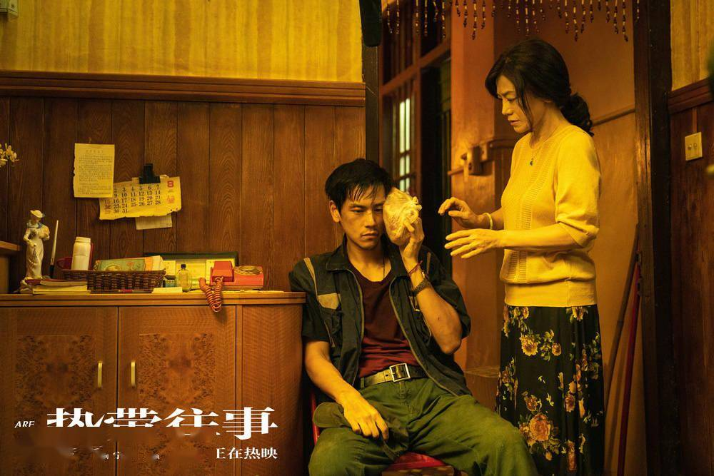

没有浮夸的喧闹，只是一场孤独的狂欢。

就如同其英文名 Are you lonesome tonight 一般，这部犯罪类型电影独具一种别致的艺术感。

彭于晏在影片中饰演了一名外形颓靡不修但眼神倔强的空调修理工，电影开始便是他在监狱中的生活，
镜头一转，来到了一个看起来潮湿普通的傍晚。他开着车，车里正大声放着彩票摇号的广播，这里应该是预示着
他要‘中奖’了，当然这个中奖意味着遭殃。突然出现了一头牛，躺在路中间，眼里含着血泪，挡住了去路，
于是他转弯去了另一条路，却意外撞到了人，在他倒车检查，发现这人已经没了气息后，将他的尸体推进河道。
故事就这样开始了。

个人觉得这头牛的出现十分巧妙，因为足够荒诞又偏偏合情合理，它仿佛就象征着男主本人，一直勤勤恳恳地工作，又同时预示了后面一系列不幸的事情的发生。

女主正是这位受害人的妻子，因为这件事她与男主有了联系，男主对她的歉疚、保护，她对男主的特别对待，让他们之间似乎有了一种无法言说的感情，电影只通过一些细节让人感受到了这种微妙的关系。有很多人都说他们之间是爱情，但我看的时候并没有这么觉得，也不太能接受这种说法，因为这种感情是绝不会仅仅以爱情就能概括的，而是更复杂的，带着更高级层次的情感。

还有一个印象比较深刻的是那位盲人，他说他自己盲也不盲，眼盲却能看清事实的真相，同时他又是一位出色的歌手，他的歌贯穿了整个电影。
有种上帝般存在的感觉，可能导演是想表达真相往往埋藏在我们看不见的地方，以及人内心的孤独彷徨需要用音乐借以慰藉吧。

整部电影使用了很多蒙太奇手法，穿插了很多回忆，真相随着这些回忆的拼凑逐渐浮出水面，人性的纠结矛盾在一次次冲突、自我与他人的救赎中得到和解。特别喜欢男主最后走出监狱，在斑驳的阳光下奔跑的镜头，至少那一刻我与电影共情了，非常享受那一刹那的自由。

我是比较喜欢救赎为主题的电影的，也不排斥为了营造氛围凸显人物心理活动而带来的故事不够丰富的无聊，甚至欣赏这种慢慢讲述娓娓道来的风格。因为有内核的东西，是值得细细咀嚼的。
