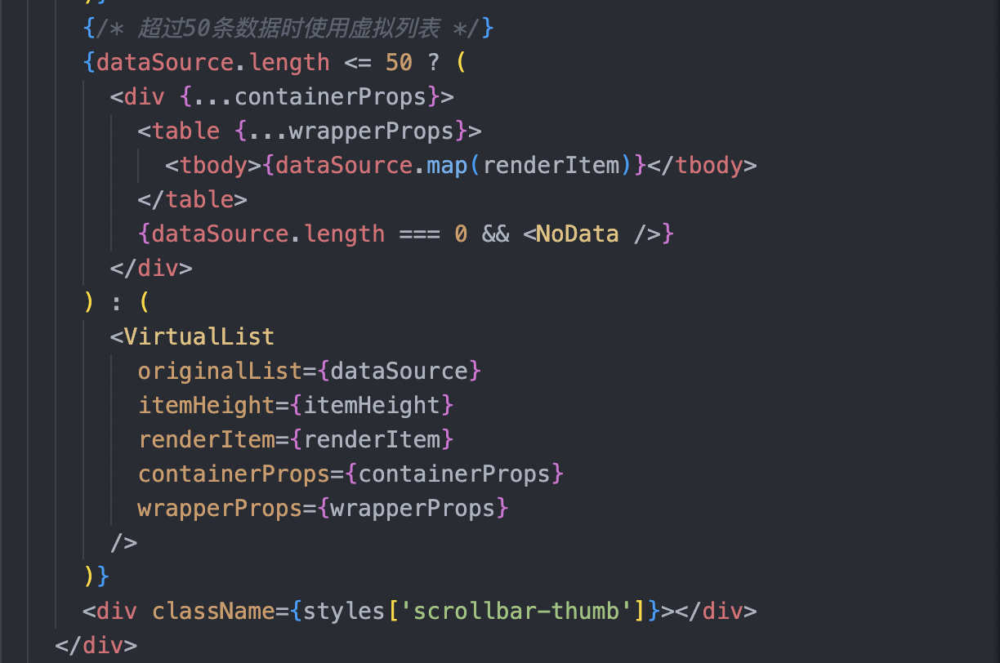
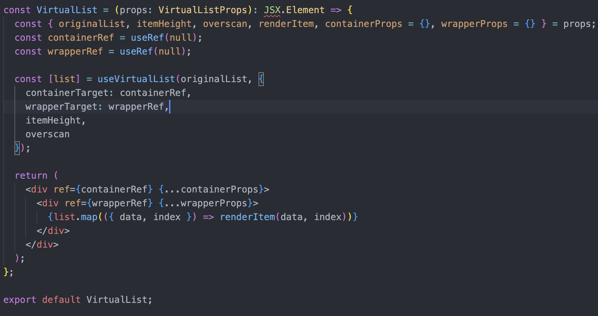
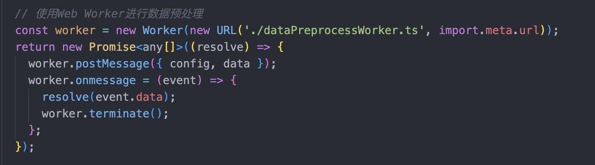

最近有客户反馈，他们的业务场景中，需要展示20000+的数据量的表格，但发现表格的渲染速度非常慢，导致无法正常使用。

经过测试，现在的表格超过3000条数据后，就会出现明显卡顿的情况。因此，我针对这个问题，进行了一系列的性能优化工作。

### 一、虚拟滚动

虚拟滚动通过只渲染可见区域的表格行，来提升渲染性能。

我选择放弃使用antd提供的表格组件，重新封装了一个表格组件，并使用虚拟滚动技术来优化表格渲染性能。

虚拟滚动使用ahook库中的useVirtualList hook，它可以帮助我们快速实现虚拟滚动功能。

### 二、引入web worker

引入web worker，可以将数据预处理和排序操作放在后台线程中进行，从而释放主线程资源，提升渲染性能。

优化后，系统能够流畅处理20000+条数据量的表格，大幅提升了数据分析效率。